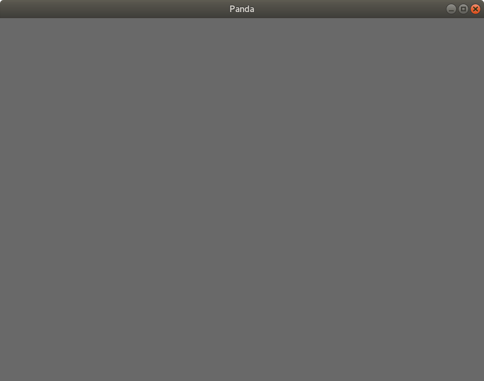

Hello World
=
_In which we learn how to make and run a Panda3D instance, and how to load and manipulate models._

At it's most basic, running a Panda3D program is quite simple: create a "ShowBase" object, and tell it to run.

Specifically, it can be convenient to make our main "game-class" a sub-class of ShowBase: this unifies our game-class with the ShowBase that we'll run, and even gives us a globally-accessible variable, named "base", that points to our game.

```python
from direct.showbase.ShowBase import ShowBase

class Game(ShowBase):
    def __init__(self):
        ShowBase.__init__(self)

game = Game()
game.run()
```

If you run the code above, a window should open titled "Panda", and showing an empty grey view:



By default, Panda3D opens an 800x600 window, which can be somewhat small. So, let's make it a little bigger.

There are a few ways of doing this, but one simple method is to "request window properties". In short, we create a "WindowProperties" object, set the properties that we want in that object, and then pass it back to Panda, requesting that it apply them.

I've chosen a window-size of 1000x750; modify this to suit your screen and preference.

```python
from direct.showbase.ShowBase import ShowBase
from panda3d.core import WindowProperties

class Game(ShowBase):
    def __init__(self):
        ShowBase.__init__(self)

        properties = WindowProperties()
        properties.setSize(1000, 750)
        self.win.requestProperties(properties)

game = Game()
game.run()
```

Panda3D by default uses a particular mouse-based camera-control. We probably don't want to use that, so we disable that control, allowing us to (later) control the camera ourselves:

```python
self.disableMouse()
```

Next, let's consider adding some models to the scene...

[On to Lesson 2][next]

[next]: tut_lesson02.html
