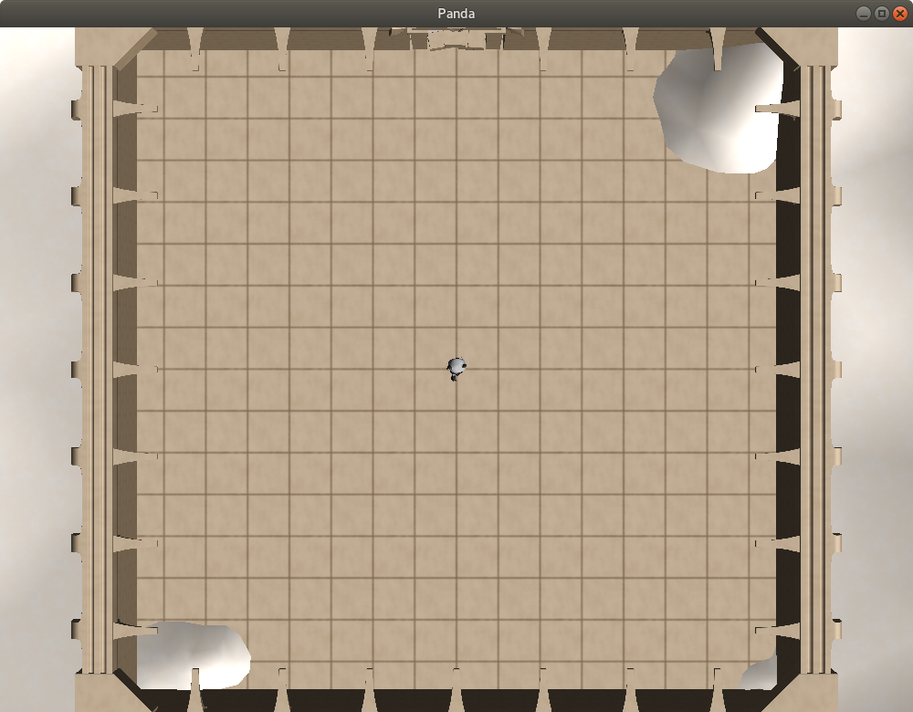
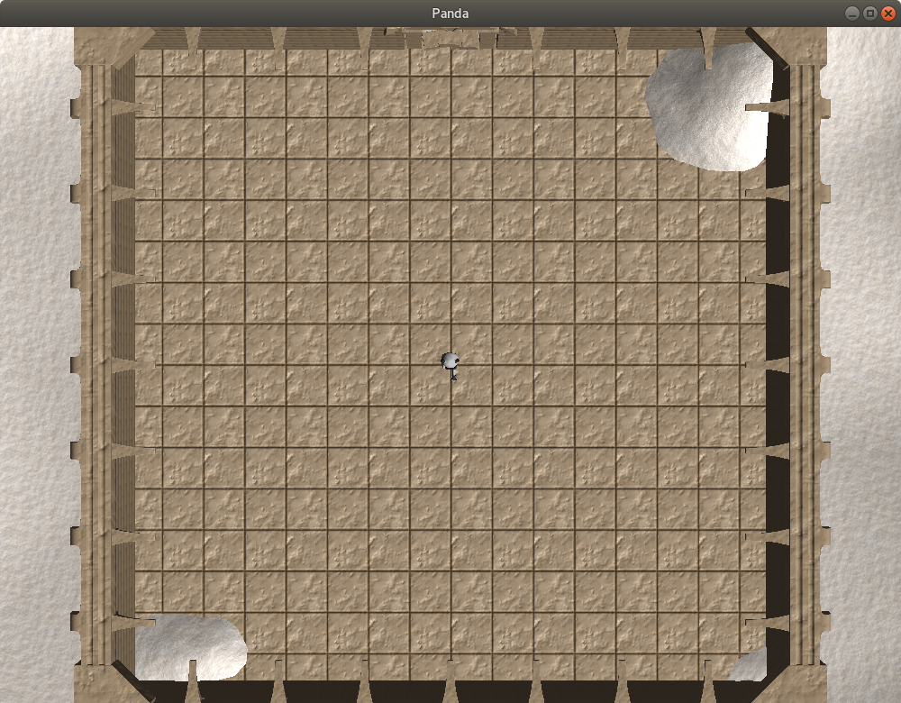

A Bit of Shading
=
_In which we learn about lighting and automatic shading_

As we noted in the last lesson, our scene looks awfully flat.

The problem, essentially, is that it's unlit. We're just seeing the base colour-textures of the objects, with no lighting to give it shape, let alone normal-mapping.

So, let's add some lights.

There are a number of types of light, but we'll look at two simple ones in this tutorial: directional lights, and ambient lights.

Ambient lights are the simpler of the two: they just fill the scene with a constant amount of light. They're useful for ensuring that unlit areas don't become entirely black.

You can create an ambient light like so:
```python
# In your import statements:
from panda3d.core import AmbientLight
```

```python
# In the body of your code--again, "__init__" will do in this case:
ambientLight = AmbientLight("ambient light")
ambientLight.setColor(Vec4(0.2, 0.2, 0.2, 1))
```

As with the camera, lights are nodes. As such, in order for them to work, we must attach them to the scene.

Indeed, the "AmbientLight" object created above is a node, not a NodePath, which is what we usually work with. But we can get a NodePath at the same time as we attach the node if, instead of telling our new node to attach itself to a parent node, we tell the parent node to attach the new one. That is, instead of calling something like "myNodePath.reparentTo(someParent)", we call "someParent.attachNewNode(myNode)". Like so:

```python
self.ambientLightNodePath = render.attachNewNode(ambientLight)
```

In addition to simply attaching the light to the scene, we also want to indicate which nodes we want it to affect. This is done by calling the relevant NodePath's "setLight" method. Note that a light will automatically affect all nodes below the indicated node, unless you specify otherwise.

Since we want our lights to affect the whole scene, we'll simply call "setLight" on "render":
```python
render.setLight(self.ambientLightNodePath)
```

(Note that we pass in the light NodePath, not the raw node!)

All in all, the code looks like this:
```python
ambientLight = AmbientLight("ambient light")
ambientLight.setColor(Vec4(0.2, 0.2, 0.2, 1))
self.ambientLightNodePath = render.attachNewNode(ambientLight)
render.setLight(self.ambientLightNodePath)
```

This doesn't make our scene any less flat, however. For that we want a slightly more complex light. There are a few such lights available; we're going to use a directional light.

The process is much the same, with a few differences: we're not going to change the light's colour (although we could, if we so desired), but we are going to change the light's direction:
```python
mainLight = DirectionalLight("main light")
self.mainLightNodePath = render.attachNewNode(mainLight)
# Turn it around by 45 degrees, and tilt it down by 45 degrees
self.mainLightNodePath.setHpr(45, -45, 0)
render.setLight(self.mainLightNodePath)
```



Ah! Now things have a bit more form! But it's still a somewhat lacking. This is because it's using old-fashioned lighting. Games these days often use shaders, allowing for things like per-pixel lighting and normal-maps that increase the amount of detail in a scene without increasing the number of polygons.

You can use your own shaders in Panda3D, but for standard shading, Panda also provides a built-in shader-generator. This includes automatic support for various standard effects, such as normal-mapping.

Activating it is quite simple: just call "setShaderAuto" on the NodePath that you want it to affect. In this case, we'll just apply the shader-generator to "render":
```python
render.setShaderAuto()
```



There! Much better, I think!

Of course, this game doesn't do much yet. Let's change that next...

[On to Lesson 4][next]

[next]: tut_lesson04.html
