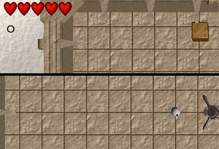
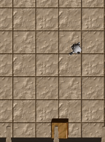

Visibly Healthy
=
_In which we show the player's health and score, indicate how healthy the enemy is, and add some feedback to hits_

As things stand, damage is being done to our characters, but that damage isn't terribly apparent. Furthermore, there's little feedback on achieving a hit, or taking damage. So let's change that.

This is another lesson that won't touch on many new Panda-specific matters, and which I thus intend to somewhat skim over. Once again however, I do intend to at least in brief describe what I'm doing!

First of all, let's display the player's health and score, both near the top-left of the screen. 

The score will simply be text, and we'll show it via Panda's handy "OnscreenText" class, which allows one to quickly and easily throw some text onto the screen. This class can be limiting at times, and for more complex purposes, Panda offers other, more-powerful text-classes. But for our purposes here, OnscreenText will be fine.

The player's health will be displayed as a row of "heart"-icons, using a similar class: "OnscreenImage". In terms of logic, we'll simply keep a list of these icons, and display the appropriate number of them for the player's current health. It's not an elegant or efficient approach, but it's simple.

In "GameObject.py":

```python
# In your "import" statements:
from direct.gui.OnscreenText import OnscreenText
from direct.gui.OnscreenImage import OnscreenImage
from panda3d.core import TextNode
```

```python
# In the "__init__" method of "Player":
self.score = 0

self.scoreUI = OnscreenText(text = "0",
                            pos = (-1.3, 0.825),
                            mayChange = True,
                            align = TextNode.ALeft)

self.healthIcons = []
for i in range(self.maxHealth):
    icon = OnscreenImage(image = "UI/health.png",
                         pos = (-1.275 + i*0.075, 0, 0.95),
                         scale = 0.04)
    # Since our icons have transparent regions,
    # we'll activate transparency.
    icon.setTransparency(True)
    self.healthIcons.append(icon)
```

```python
# In the "Player" class:
def updateScore(self):
    self.scoreUI.setText(str(self.score))

def alterHealth(self, dHealth):
    GameObject.alterHealth(self, dHealth)

    self.updateHealthUI()

def updateHealthUI(self):
    for index, icon in enumerate(self.healthIcons):
        if index < self.health:
            icon.show()
        else:
            icon.hide()
```

```python
# And finally, in the "cleanup" method of "Player":
self.scoreUI.removeNode()

for icon in self.healthIcons:
    icon.removeNode()
```

As for the Walking Enemy's health, we'll simply shade its model to black as it becomes more damaged. This is achieved by applying a colour-scale to its Actor--that is, a colour by which the model's colours will be multiplied.

```python
# In the "WalkingEnemy" class:
def alterHealth(self, dHealth):
    Enemy.alterHealth(self, dHealth)
    self.updateHealthVisual()

def updateHealthVisual(self):
    perc = self.health/self.maxHealth
    if perc < 0:
        perc = 0
    # The parameters here are red, green, blue, and alpha
    self.actor.setColorScale(perc, perc, perc, 1)
```

Now we can see the effect of damage done, on both our player-character and the enemy!



Next, let's attend to our laser. It's not all that satisfying to hit enemies with it--it does damage, but there's little feedback as it does. A hit looks no different to a miss.

So, we're going to add two effects that will show up when we hit a Walking Enemy (but not a Trap Enemy, as they're invulnerable): First, a sort of hit-flash will appear, pulsing and randomly changing its orientation to give the impression of coruscating rays of light. And second, we're going to add a point-light, to give it a bit more glow.

```python
# In your "import" statements:
from panda3d.core import Vec4

from panda3d.core import PointLight
```

```python
# In the "__init__" method of Player:
self.beamHitModel = loader.loadModel("Models/Misc/bambooLaserHit")
self.beamHitModel.reparentTo(render)
self.beamHitModel.setZ(1.5)
self.beamHitModel.setLightOff()
self.beamHitModel.hide()

self.beamHitPulseRate = 0.15
self.beamHitTimer = 0

self.beamHitLight = PointLight("beamHitLight")
self.beamHitLight.setColor(Vec4(0.1, 1.0, 0.2, 1))
# These "attenuation" values govern how the light
# fades with distance. They are, respectively,
# the constant, linear, and quadratic coefficients
# of the light's falloff equation.
# I experimented until I found values that
# looked nice.
self.beamHitLight.setAttenuation((1.0, 0.1, 0.5))
self.beamHitLightNodePath = render.attachNewNode(self.beamHitLight)
# Note that we haven't yet applied the light to
# a NodePath, and so it won't yet illuminate
# anything.
```

```python
# In the "update" method of Player:

# In short, run a timer, and use the timer in a sine-function
# to pulse the scale of the beam-hit model. When the timer
# runs down (and the scale is at its lowest), reset the timer
# and randomise the beam-hit model's rotation.
self.beamHitTimer -= dt
if self.beamHitTimer <= 0:
    self.beamHitTimer = self.beamHitPulseRate
    self.beamHitModel.setH(random.uniform(0.0, 360.0))
self.beamHitModel.setScale(math.sin(self.beamHitTimer*3.142/self.beamHitPulseRate)*0.4 + 0.9)
```

We'll be adding lines within the 'if keys["shoot"]' code-section that we already have in Player's "update" method. So, instead of just showing the new lines, I'm going to show the full section of code and mark the new lines with "# NEW!!!":

```python
# In the "update" method of Player:

if keys["shoot"]:
    if self.rayQueue.getNumEntries() > 0:
        # NEW!!!
        scoredHit = False

        self.rayQueue.sortEntries()
        rayHit = self.rayQueue.getEntry(0)
        hitPos = rayHit.getSurfacePoint(render)

        hitNodePath = rayHit.getIntoNodePath()
        if hitNodePath.hasPythonTag("owner"):
            hitObject = hitNodePath.getPythonTag("owner")
            if not isinstance(hitObject, TrapEnemy):
                hitObject.alterHealth(self.damagePerSecond*dt)
                # NEW!!!
                scoredHit = True

        beamLength = (hitPos - self.actor.getPos()).length()
        self.beamModel.setSy(beamLength)

        self.beamModel.show()

        # NEW!!!
        if scoredHit:
            self.beamHitModel.show()

            self.beamHitModel.setPos(hitPos)
            self.beamHitLightNodePath.setPos(hitPos + Vec3(0, 0, 0.5))

            # If the light hasn't already been set here, set it
            if not render.hasLight(self.beamHitLightNodePath):
                # Apply the light to the scene, so that it
                # illuminates things
                render.setLight(self.beamHitLightNodePath)
        else:
            # If the light has been set here, remove it
            # See explanation in the tutorial-text below...
            if render.hasLight(self.beamHitLightNodePath):
                # Clear the light from the scene, so that it
                # no longer illuminates anything
                render.clearLight(self.beamHitLightNodePath)

            self.beamHitModel.hide()
else:
    # NEW!!!
    if render.hasLight(self.beamHitLightNodePath):
        # Clear the light from the scene, so that it
        # no longer illuminates anything
        render.clearLight(self.beamHitLightNodePath)

    self.beamModel.hide()

    # NEW!!!
    self.beamHitModel.hide()
```

And finally, some more cleaning up:

```python
# In the "cleanup" method of Player:
self.beamHitModel.removeNode()

render.clearLight(self.beamHitLightNodePath)
self.beamHitLightNodePath.removeNode()
```

Before we move on, I want to talk about how we used the point-light above. Specifically, these lines:

```python
if render.hasLight(self.beamHitLightNodePath):
    render.clearLight(self.beamHitLightNodePath)
```

NodePaths have two means of preventing a light from affecting them (and their children): "clearLight" and "setLightOff". These seem similar, but aren't. The "clearLight" method removes a light that has been applied to the node via "setLight". The "setLightOff" method places a note of sorts on the node that indicates that the light in question shouldn't affect it--regardless of where the light was applied. This can be useful for specifying that a given node should not be lit, despite "setLight" having been applied to one of its parents, for example.

So why not use "setLightOff" here? Because those "notes" (called "attribs") accumulate. By calling "setLightOff", we're not removing the light from the node, we're adding successive attribs saying "don't light this".

With all that done, our laser should now be a bit more striking when it hits a Walking Enemy!


And finally, we'll turn the tables and add a hit-flash that shows that the player has taken damage.

Functionally, this will be pretty much the same as the hit-flash that we used for the laser, except that instead of pulsing continuously, it will pulse just once. 

Furthermore, since our player-character has only five health-points, let's make a hit to the player very obvious, and so make our hit-flash rather large.

```python
# In the "__init__" method of Player:

self.damageTakenModel = loader.loadModel("Models/Misc/playerHit")
self.damageTakenModel.setLightOff()
self.damageTakenModel.setZ(1.0)
self.damageTakenModel.reparentTo(self.actor)
self.damageTakenModel.hide()

self.damageTakenModelTimer = 0
self.damageTakenModelDuration = 0.15
```
```python
# In the "update" method of Player:

if self.damageTakenModelTimer > 0:
    self.damageTakenModelTimer -= dt
    self.damageTakenModel.setScale(2.0 - self.damageTakenModelTimer/self.damageTakenModelDuration)
    if self.damageTakenModelTimer <= 0:
        self.damageTakenModel.hide()
```

```python
# In the "alterHealth" method of Player:

self.damageTakenModel.show()
self.damageTakenModel.setH(random.uniform(0.0, 360.0))
self.damageTakenModelTimer = self.damageTakenModelDuration
```

Now hits against the player should hopefully feel a bit more impactful, too!



Of course, as things stand, neither enemy nor player actually suffers from losing health. We'll get to the player later, but let's change this for our Walking Enemies next. Indeed, let's get them both dying and spawning next...

[On to Lesson 13][next]

[next]: tut_lesson13.html
